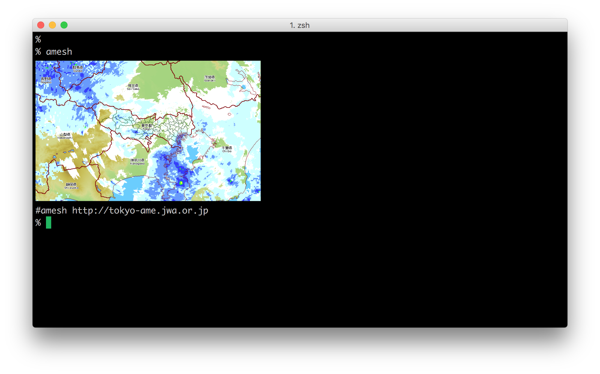
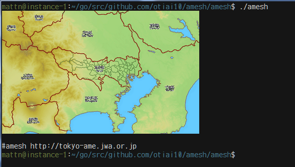
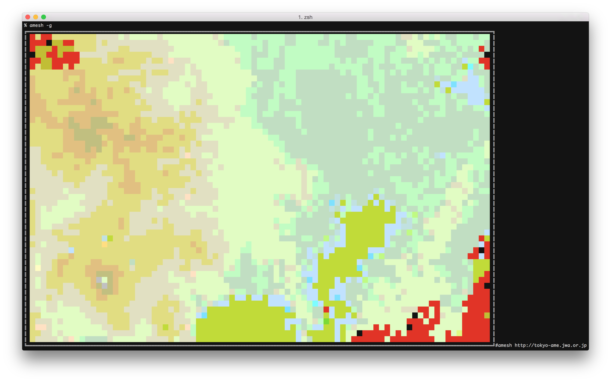
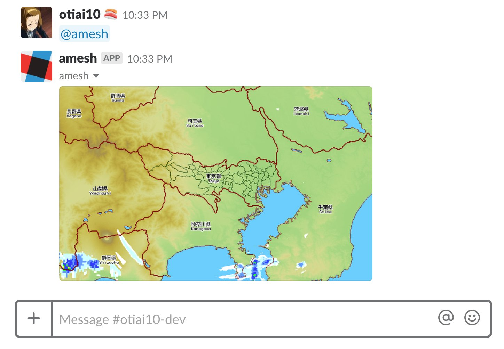

# amesh

[](https://pkg.go.dev/github.com/otiai10/amesh)
[](https://github.com/otiai10/amesh/actions?query=workflow%3AGo)
[](https://github.com/otiai10/amesh/actions/workflows/release.yml)
[](https://codecov.io/gh/otiai10/amesh)
[](https://goreportcard.com/report/github.com/otiai10/amesh)
[](https://pkg.go.dev/github.com/otiai10/amesh)

みんな大好き東京アメッシュ http://tokyo-ame.jwa.or.jp/
をCLIで表示

| 描画方式 | 対応ターミナル | 使用感 |
|:------:|:------:|:------:|
| iTerm2<br>Inline Images | iTerm2 |  |
| Sixel | WezTerm, mlterm,<br>その他Sixel対応 |  |
| デフォルト<br>（文字描画） | すべてのターミナル |  |


# Install

**Goを使う**
```sh
go install github.com/otiai10/amesh@latest
```

**Homebrewを使う**
```sh
brew install otiai10/tap/amesh
```

**Dockerで使う**
```sh
docker run -it --rm otiai10/amesh
```

# Usage

```sh
amesh      # 降雨状況と地形と地名・県境を表示
amesh -a   # 直近30分をタイムラプスで表示
amesh -g=0 # 地形情報を非表示
amesh -b=0 # 地名・県境を非表示
amesh -p   # iTermを使っててもピクセル表示
```

# 大阪？

```sh
amesh osaka
# TODO: ameshじゃないので名前変える
```

# Slackで @amesh って言うとアメッシュの画像出すbot



詳しくは、 https://github.com/otiai10/amesh-bot
